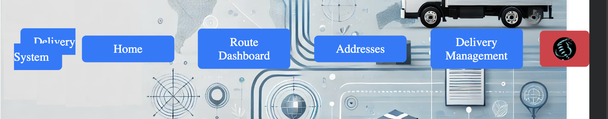
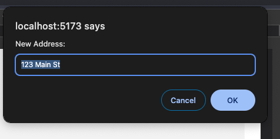
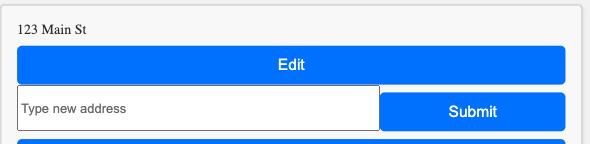
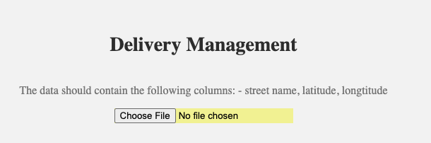

## Features

- Should be responsive. Check if all elements in the project look good on small screens. For example, navbar could be adjusted a bit.
  

- At "Delivery Management" page user can upload file with address, but he can not write the address himself. It would be great to have not only upload file functionality, but also a normal input, where user can write address himself.

- At "Delivery Management" page if user clicks on "Edit" button he receives a modal window like this:
  
- It would be better to show the input below like this:  
  

- At "Delivery Management" page it is unclear in which format the data should be uploaded. I would add a `<p>` with explanation like this:
  

- You have list of addresses at "My addresses" and at "Delivery Management" page, but what is the difference between them? You should add a description for user or indicate somehow what it used for.

- At Route Dashboard it would be great to see not only street name, but also the city and country.

- It would be great to add some description of the project at home page. Usually at home page you can see the list of features, information how project can help user and so on.

## Client

- AuthForm.jsx component is not imported anywhere. Do you use it? If not I would suggest to delete it.

- MapDisplay.test.jsx won't work, because you have here jest. Jest can not be configured for the client in this case. If you want to add unit testing, I would recommend to try with vitest. But the unit testing does nothing for user and it may only help you with development.

- ErrorBoundary.jsx may be deleted completely. It is class component, which is old and not used anymore.

- It is better to write all components name with the capital letter. I would suggest to rename Dashboard.jsx to Dashboard.jsx

- You have a lot of comments in code. In general it's recommended to have comments only when absolutely necessary and no one understands what's going on here without the comment. If it is not the case, I would remove comments.

- You also have a lot of commented code. It's hard to read and navigate, so I would suggest to delete all commented code if you don't plan to use it. If you want to keep it, than it would be better to have additional file like you have delivery.js and delivery_backup.js. In backup files you can save the code for later and it won't interfere in the main files.

- index.tsx should be deleted. This project is not configured to be a Typescript project and this file will never be used.

- It seems babel.config.js is not used anywhere and it won't work because you try to use commonJS (module.exports) in client. I would suggest deleting it.

- clerk-config.js won't work like this and I would say you don't need it. Clerk is already configured in App.jsx. It would be better to delete this file.

- You have 2 files with a name index.html. One in src/index.html and one outside of src in the root of the project.

src/index.html - this one should be removed. You have here a lot of code related to leaflet, which would be suitable for vanilla project (project without any frameworks), but not for react project. It is also important that index.html should be outside of src folder. It won't work like this.

- I noticed some packages in package.json that may be removed. I marked it up with comment. You can unistall the package with `npm uninstall name-of-the-package`. For example, `npm uninstall @babel/preset-env`

```json
  "devDependencies": {
    "@babel/preset-env": "^7.26.0", // <--- Could be deleted. It is not necessary.
    "@babel/preset-react": "^7.25.9", // <--- Could be deleted. It is not necessary.
    "@eslint/js": "^9.13.0",
    "@testing-library/jest-dom": "^6.6.3", // <--- It is better to use vitest here. I would suggest removing this package.
    "@testing-library/react": "^16.0.1",  // <--- It is better to use vitest here. I would suggest removing this package.
    "@types/react": "^18.3.12",  // <--- It won't work in this project. Better to be deleted.
    "@types/react-dom": "^18.3.1",  // <--- It won't work in this project. Better to be deleted.
    "@vitejs/plugin-react-swc": "^3.5.0",
    "babel-jest": "^29.7.0", // <--- It is better to use vitest here. I would suggest removing this package.
    "eslint": "^9.13.0",
    "eslint-plugin-react": "^7.37.2",
    "eslint-plugin-react-hooks": "^5.0.0",
    "eslint-plugin-react-refresh": "^0.4.14",
    "globals": "^15.11.0",
    "jest": "^29.7.0", // <--- It is better to use vitest here. I would suggest removing this package.
    "vite": "^5.4.10"
  },
  "jest": { // <--- It is better to use vitest here. I would suggest removing this.
    "transform": {
      "^.+\\.[t|j]sx?$": "babel-jest"
    }
  }
```
